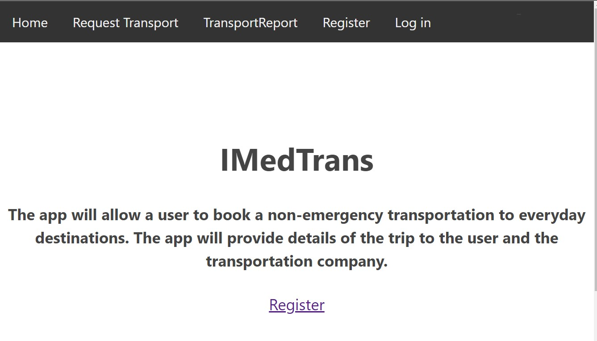
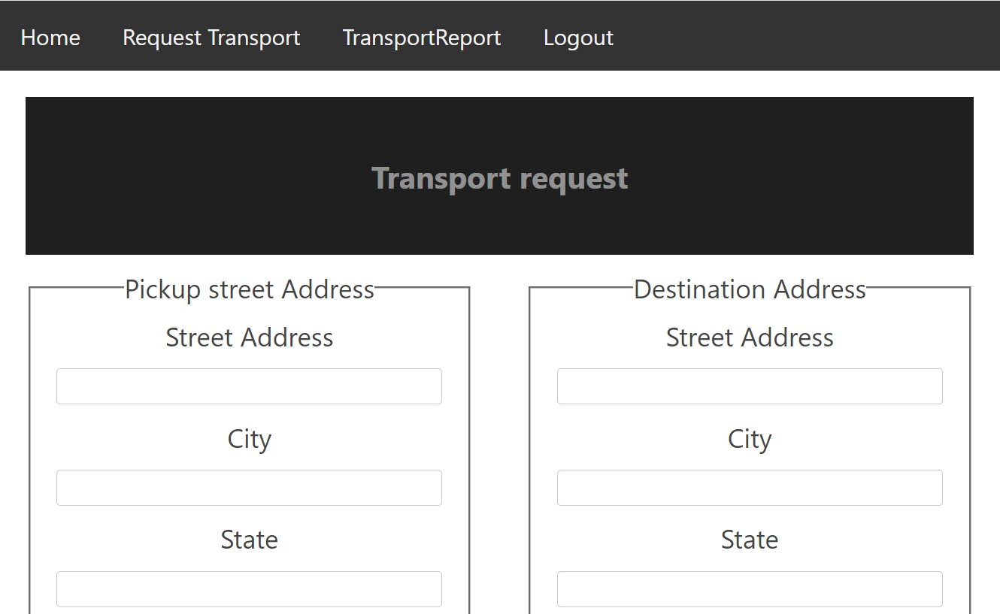

# IMedTrans-api

A backend express api server app to the IMedTrans-app

## summary

API server that manages transportation data for the front end app (IMedTrans-app)

## Live front end app

[IMedTrans](https://protech-app.vercel.app/collection).

## Front Repo

[Git](https://github.com/dadetifa1/Protech-api).

## Screen Shots

Capture a sale:

Sales collection(s):

## Tech used

JS - NodeJS - Express - postgres - Git - Relationship DB

## API documentation

**Get all requested transport**

**URL**

/api/imedtransport/user/transportlog

- **Method:**

  `GET`

- **Header:**

  Authorization

- **Success Response:**

  - **Code:** 200  
    **Content:** `[ { "transportid": 1, "starting_location": "{\"pickUpFullAddress\":\"1725 Dellwood Ave 102,roseville,mn,55113\",\"lat\":44.9932159,\"lng\":-93.155328}", "destination_location": "{\"desFullAddress\":\"4958 Sheridan ave s,minneapolis,mn,55410\",\"lat\":44.9125439,\"lng\":-93.3128862}", "date_of_transport": "2021-03-10T01:15:00.000Z", "mileage": "14.8", "user_name": "dele" } ]`

- **Error Response:**

  - **Code:** 404 UNAUTHORIZED  
    **Content:** `{ error : "There are not transport(s) setup for the user" }`

  - **Code:** 401 UNAUTHORIZED  
    **Content:** `{ error : "Unauthorized request" }`

**User sign up**

**URL**

/api/imedtransport/user

- **Method:**

  `POsT`

- **Header:**

  Authorization

- **Success Response:**

  - **Code:** 201  
    **Content:** ` { "userid": 1, "useremail": "tester@home.com", }`

- **Error Response:**

  - **Code:** 400 UNAUTHORIZED  
    **Content:** `{ error : "Missing key in request body" }`

**Make a request for transportation**

**URL**

/api/imedtransport/user/transportreq

- **Method:**

  `POST`

- **Header:**

  Authorization

- **Success Response:**

  - **Code:** 201  

- **Error Response:**

  - **Code:** 401 UNAUTHORIZED  
    **Content:** `{ error : "Unauthorized request" }`
